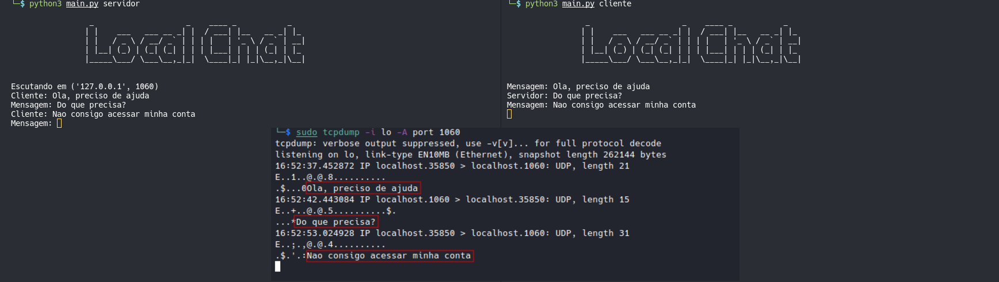
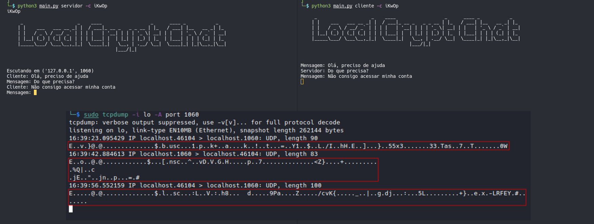

# Sobre o projeto

Esse projeto é uma continuação do [udp-chat](https://github.com/gooday4u/udp-chat).</br>
Nessa continuação foi implementada criptografia entre o cliente e o servidor, com o uso da biblioteca simple-crypt.</br>
Foram realizadas análises de tráfego entre as trocas de mensagems para prova de conceito acerca da confiablidade da informação que trafega na rede com e sem criptografia.<br>

<h2>Demonstrações</h2>

1 - Esta análise de tráfego com o tcpdump foi realizada no [udp-chat](https://github.com/gooday4u/udp-chat), no qual não havia nenhuma criptografia implementada.</br>



Como pode ser observado na análise, a confidencialidade da informação é perdida.

2 - Diante disso, após a implementação da criptografia pode se observar que a confiabilidade da informação permanece ao trafegar na rede:




<h2>Uso<h2>

1 - Bibliotecas necessárias:

```
pip install -r requirements.txt
```

2 - Execute o servidor e chave que vai ser usada durante a troca de mensagens por argumento: 

```
└─$ python3 main.py servidor -p 44001 -c iKwOp

     _                    _    ____                  _      ____ _           _   
    | |    ___   ___ __ _| |  / ___|_ __ _   _ _ __ | |_   / ___| |__   __ _| |_ 
    | |   / _ \ / __/ _` | | | |   | '__| | | | '_ \| __| | |   | '_ \ / _` | __|
    | |__| (_) | (_| (_| | | | |___| |  | |_| | |_) | |_  | |___| | | | (_| | |_ 
    |_____\___/ \___\__,_|_|  \____|_|   \__, | .__/ \__|  \____|_| |_|\__,_|\__|
                                        |___/|_|                                
                                                                                                                                                 
    
Escutando em ('127.0.0.1', 44001)
```

3 - Logo após, basta executar o cliente com a mesma chave que está sendo usada pelo servidor:

```
└─$ python3 main.py cliente -p 44001 -c iKwOp

     _                    _    ____                  _      ____ _           _   
    | |    ___   ___ __ _| |  / ___|_ __ _   _ _ __ | |_   / ___| |__   __ _| |_ 
    | |   / _ \ / __/ _` | | | |   | '__| | | | '_ \| __| | |   | '_ \ / _` | __|
    | |__| (_) | (_| (_| | | | |___| |  | |_| | |_) | |_  | |___| | | | (_| | |_ 
    |_____\___/ \___\__,_|_|  \____|_|   \__, | .__/ \__|  \____|_| |_|\__,_|\__|
                                        |___/|_|                                
                                                                                                                                                 
    
Mensagem: 
```

Pronto, a conexão está estabelecida e a troca de mensagens pode ser realizada com segurança.

